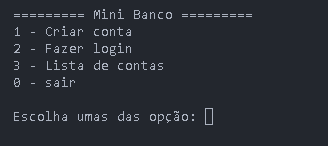
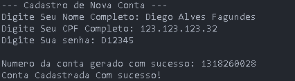
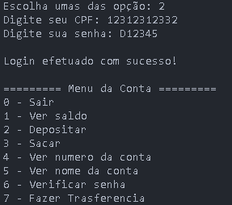

# Mini Banco

Sistema bancario simples desenvolvido em C++ para praticar programacao orientada a objetos, manipulacao de arquivos e regras basicas de operacoes financeiras em uma aplicacao de console.

## Descricao

O Mini Banco permite criar contas, fazer login com CPF e senha, consultar saldo, depositar, sacar e realizar transferencias entre contas cadastradas. Os dados sao armazenados localmente em arquivos `.txt`, simulando uma base de dados simples.

> Status: projeto em desenvolvimento.

## Objetivo do projeto

O objetivo deste projeto e consolidar conceitos fundamentais de C++, incluindo:

- Criacao e organizacao de classes.
- Separacao entre arquivos `.h` e `.cpp`.
- Leitura e escrita de arquivos.
- Validacao basica de entradas do usuario.
- Simulacao de fluxo bancario em terminal.

## Funcionalidades

- Criacao de conta com nome, CPF e senha.
- Geracao automatica de numero de conta.
- Login com CPF e senha.
- Consulta de saldo.
- Deposito em conta.
- Saque com validacao de saldo.
- Consulta do numero da conta.
- Consulta do nome cadastrado.
- Transferencia entre contas usando CPF do destinatario.
- Persistencia dos dados em arquivo local.

## Tecnologias usadas

- C++
- MinGW/g++
- Biblioteca padrao do C++
- Manipulacao de arquivos com `fstream`
- Terminal/console

## Como rodar o projeto

### Pre-requisitos

- Ter um compilador C++ instalado, como `g++`.
- Usar um terminal na pasta raiz do projeto.

### Compilar

```bash
g++ -std=c++17 -Iinclude src/main.cpp src/conta.cpp -o mini-banco.exe
```

### Executar

```bash
./mini-banco.exe
```

No Windows PowerShell:

```powershell
.\mini-banco.exe
```

> Observacao: o programa utiliza a pasta `data/` para armazenar dados locais. Os arquivos `.txt` dessa pasta nao devem ser enviados ao GitHub quando contiverem CPFs, senhas ou dados pessoais.

## Estrutura de pastas

```text
mini-banco/
|-- data/
|   `-- .gitkeep
|-- docs/
|   |-- planejamento.md
|   `-- regras.md
|-- include/
|   `-- conta.h
|-- src/
|   |-- conta.cpp
|   `-- main.cpp
|-- .gitignore
`-- README.md
```

## Prints ou demonstracao

Adicione aqui imagens ou GIFs mostrando o projeto em funcionamento:

- Print do menu inicial:



- Print da criacao de conta:



- Print do login:



- Print de deposito, saque ou transferencia:


## Aprendizados

Durante o desenvolvimento deste projeto, foram praticados:

- Organizacao de um projeto C++ em pastas.
- Criacao de classes para representar contas e operacoes.
- Uso de arquivos `.txt` para persistencia de dados.
- Validacao de CPF e senha em nivel basico.
- Atualizacao de registros salvos em arquivo.
- Controle de fluxo com menus no terminal.

## Melhorias futuras

- Criar um loop no menu inicial para permitir varias operacoes sem reiniciar o programa.
- Corrigir textos exibidos no terminal e padronizar acentuacao.
- Esconder a senha durante a digitacao.
- Remover a opcao que mostra a senha cadastrada.
- Adicionar extrato de transacoes.
- Validar CPF com algoritmo oficial.
- Separar melhor as responsabilidades entre classes.
- Adicionar testes automatizados.
- Criar um `Makefile` ou `CMakeLists.txt` para facilitar a compilacao.
- Substituir arquivos `.txt` por um banco de dados simples, como SQLite.

## Autor

Desenvolvido por Diego Alves.

- GitHub: [Diego-Fagundes888](https://github.com/Diego-Fagundes888)
-- LinkedIn: [Diego Alves](https://www.linkedin.com/in/diegofagundes-back/)
